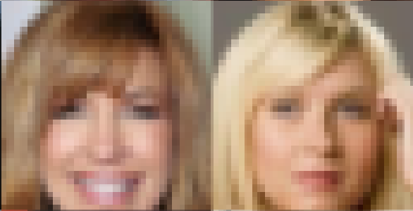
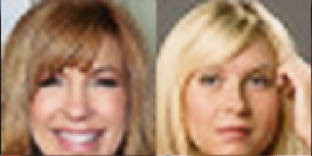
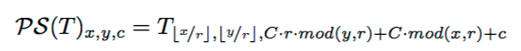
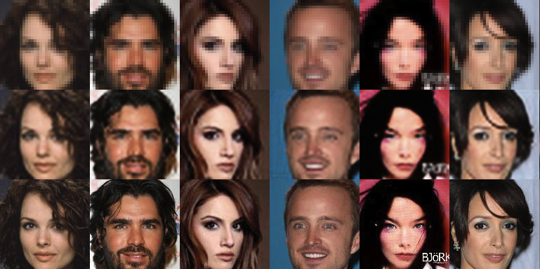

subpixel: A subpixel convolutional neural network implementation with Tensorflow
====================

Left: input images / Right: output images with 4x super-resolution after 6 epochs:

 

See more examples inside the [images](./images/) folder.

In CVPR 2016 Shi et. al. from Twitter VX (previously Magic Pony)
published a paper called Real-Time Single Image and Video Super-Resolution
Using an Efficient Sub-Pixel Convolutional Neural Network [1]. Here we propose
a reimplementation of their method and discuss future applications of the
technology.

But first let us discuss some background.

## Convolutions, transposed convolutions and subpixel convolutions

Convolutional neural networks (CNN) are now standard neural network layers for
computer vision. Transposed convolutions (sometimes referred to as deconvolution)
are the GRADIENTS of a convolutional layer. Transposed convolutions were, as
far as we know first used by Zeiler and Fergus [2] for visualization purposes
while improving their AlexNet model.

For visualization purposes let us check out that convolutions in the
present subject are a sequence of
inner product of a given filter (or kernel) with pieces of a larger image. This
operation is highly parallelizable, since the kernel is the same throughout the
image. People used to refer to convolutions as locally connected layers with
shared parameters. Checkout the figure bellow by Dumoulin and Visin [3]:


[source](https://github.com/vdumoulin/conv_arithmetic)

Note though that convolutional neural networks can be defined with `strides`
or we can follow the convolution with `maxpooling` to
downsample the input image. The equivalent `backward` operation of a
convolution with strides, in other words its gradient, is an upsampling
operation, where zeros a filled in between non-zeros pixels followed by a
convolution with the kernel rotated 180 degrees. See representation copied from Dumoulin and
Visin again:


[source](https://github.com/vdumoulin/conv_arithmetic)

For classification purposes, all that we need is the feedforward pass of a
convolutional neural network to extract features at different scales. But for
applications such as image super resolution and autoencoders, both downsampling
and upsampling operations are necessary in a feedforward pass. The community
took inspiration on how the gradients are implemented in CNNs and applied them as
a feedforward layer instead.

But as one may have observed the upsampling operation as implemented above
with strided convolution gradients adds
zero values to the upscale the image, that have to be later filled
in with meaningful values. Maybe even worse, these zero values have no gradient
information that can be backpropagated through.

To cope with that problem, Shi et. al [1] proposed what we argue to be one the
most useful recent convnet tricks (at least in my opinion as a generative model researcher!) They
proposed a subpixel convolutional neural network layer for upscaling. This
layer essentially uses regular convolutional layers followed by a specific type
of image reshaping called a phase shift. In other words, instead of putting zeros
in between pixels and having to do extra computation, they
calculate more convolutions in lower resolution and resize the resulting map
into an upscaled image. This way, no meaningless zeros are necessary.
Checkout the figure below from their paper. Follow the colors to have an intuition about how they do the
image resizing. Check [this paper](https://arxiv.org/abs/1609.07009) for further understanding.


[source](https://arxiv.org/abs/1609.05158)

Next we will discuss our implementation of this method and later what we
foresee to be the implications of it everywhere where upscaling in convolutional neural
networks was necessary.

## Subpixel CNN layer

Following Shi et. al. the equation for implementing the phase shift for CNNs is:


[source](https://arxiv.org/abs/1609.05158)

In numpy, we can write this as

```python
def PS(I, r):
  assert len(I.shape) == 3
  assert r>0
  r = int(r)
  O = np.zeros((I.shape[0]*r, I.shape[1]*r, I.shape[2]/(r*2)))
  for x in range(O.shape[0]):
    for y in range(O.shape[1]):
      for c in range(O.shape[2]):
        c += 1
        a = np.floor(x/r).astype("int")
        b = np.floor(y/r).astype("int")
        d = c*r*(y%r) + c*(x%r)
        print a, b, d
        O[x, y, c-1] = I[a, b, d]
  return O
```

To implement this in Tensorflow we would have to create a custom operator and
its equivalent gradient. But after staring for a few minutes in the image
depiction of the resulting operation we noticed how to write that using just
regular `reshape`, `split` and `concatenate` operations. To understand that
note that phase shift simply goes through different channels of the output
convolutional map and builds up neighborhoods of `r x r` pixels. And we can do the
same with a few lines of Tensorflow code as:

```python
def _phase_shift(I, r):
    # Helper function with main phase shift operation
    bsize, a, b, c = I.get_shape().as_list()
    X = tf.reshape(I, (bsize, a, b, r, r))
    X = tf.transpose(X, (0, 1, 2, 4, 3))  # bsize, a, b, 1, 1
    X = tf.split(1, a, X)  # a, [bsize, b, r, r]
    X = tf.concat(2, [tf.squeeze(x) for x in X])  # bsize, b, a*r, r
    X = tf.split(1, b, X)  # b, [bsize, a*r, r]
    X = tf.concat(2, [tf.squeeze(x) for x in X])  #
    bsize, a*r, b*r
    return tf.reshape(X, (bsize, a*r, b*r, 1))

def PS(X, r, color=False):
  # Main OP that you can arbitrarily use in you tensorflow code
  if color:
    Xc = tf.split(3, 3, X)
    X = tf.concat(3, [_phase_shift(x, r) for x in Xc])
  else:
    X = _phase_shift(X, r)
  return X
```

The reminder of this library is an implementation of a subpixel CNN using the proposed `PS`
implementation for super resolution of celeb-A image faces. The code was written on top of
[carpedm20/DCGAN-tensorflow](https://github.com/carpedm20/DCGAN-tensorflow), as so, follow the same instructions to use it:

```
$ python download.py --dataset celebA  # if this doesn't work, you will have to download the dataset by hand somewhere else
$ python main.py --dataset celebA --is_train True --is_crop True
```

## Subpixel CNN future is bright

Here we want to forecast that subpixel CNNs are going to ultimately replace
transposed convolutions (deconv, conv grad, or whatever you call it) in
feedforward neural networks. Phase shift's gradient is much more meaningful and resizing
operations are virtually free computationally. Our implementation is a high
level one, using default Tensorflow OPs. But next we will rewrite everything
with Keras so that an even larger community can use it. Plus, a cuda backend
level implementation would be even more appreciated.

But for now we want to encourage the community to experiment replacing deconv layers with subpixel operatinos everywhere. By everywhere we mean:

* Conv-deconv autoencoders  
    Similar to super-resolution, include subpixel in other autoencoder implementations, replace deconv layers
* Style transfer networks  
    This didn't work in a lazy plug and play in our experiments. We have to look more carefully
* Deep Convolutional Autoencoders (DCGAN)  
    We started doing this, but as predicted we have to change hyperparameters. The network power is totally different from deconv layers.
* Segmentation Networks (SegNets)    
    ULTRA LOW hanging fruit! This one will be the easiest. Free paper, you're welcome!
* wherever upscaling is done with zero padding

Join us in the revolution to get rid of meaningless zeros in feedfoward
convnets, give suggestions here, try our code!

## Sample results
The top row is the input, the middle row is the output, and the bottom row is the ground truth.  
  
by @dribnet 


## References

[1] [Real-Time Single Image and Video Super-Resolution Using an Efficient Sub-Pixel Convolutional Neural Network](https://arxiv.org/abs/1609.05158). By Shi et. al.  
[2] [Visualizing and Understanding Convolutional Networks](https://arxiv.org/abs/1311.2901). By Zeiler and Fergus.  
[3] [A guide to convolution arithmetic for deep learning](https://arxiv.org/abs/1603.07285). By Dumoulin and Visin.

## Further reading
Alex J. Champandard made a really interesting analysis of this topic in this [thread](https://twitter.com/alexjc/status/782499923753304064).   
For discussions about differences between phase shift and straight up `resize` please see the companion [notebook](https://github.com/Tetrachrome/subpixel/blob/master/ponynet.ipynb) and this [thread](https://twitter.com/soumithchintala/status/782603117300965378).
