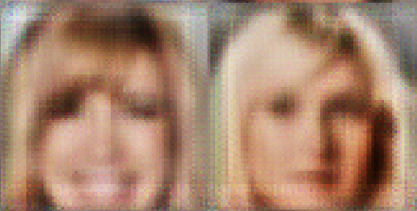

Ponynet: A subpixel CNN reimplementation with Tensorflow and Theano
====================

Input / Output after 6 epochs / Output after a few batches:
  


In this years (2016) CVPR Shi et. al. from Twitter UX (previously Magic Pony)
published a paper called Real-Time Single Image and Video Super-Resolution
Using an Efficient Sub-Pixel Convolutional Neural Network [1]. Here we propose
a reimplementation of their method and discuss future applications of the
technology.

But first let us discuss some background

## Convolutions, transposed convolutions and subpixel convolutions

Convolutional neural networks (CNN) are now standard neural network layers for
computer vision. Transposed convolutions (sometimes refered as deconvolution)
are the GRADIENTS of a convolutional layer. Transposed convolutions were, as
far as we know first used by Zeiler and Fergus [2] for visualization purposes
while improving their AlexNet model. 

For visualization purposes let us check out that convolutions in the
present subject are a sequence of
inner product of a given filter (or kernel) with pieces of a larger image. This
operation is highly parallelizable, since the kernel is the same throughout the
image. People used to refer to convolutions as locally connected layers with
shared parameters. Checkout the figure bellow by Dumoulin and Visin [3]:


Note though that convolutional neural networks can be defined with `strides`
or we can follow the convolution with `maxpooling` to
downsample the input image. The equivalent `backward` operation of a
convolution with strides, in other words its gradient, is an upsampling
operation, where zeros a filled in between non-zeros pixels followed by a
convolution with the kernel matrix. See representation copied from Dumoulin and
Visin again:


For classification purposes, all that we need is the feedforwd pass of
convolutional neural networks to extract features at different scales. But for
applications such as image superresolution and autoencoders, both downsampling
and upsampling operations are necessary in a feedforward pass. The community
took inspiration on how the gradients are implemented in CNNs are used them as
a feedforward layer instead. 

But as one may have observed the upsampling operation as implemented above
with strided convolution gradients adds
zero values to the upscale the image. Zero values that have to be latter filled
in with meanigful values. Maybe even worse, these zero values have no gradient
information that can be backpropagated through. 

To cope with that problem, Shi et. al [1] proposed what we argue to be one the
most useful recent convnet tricks. Note: this is biased because my rearch is
mostly on generative models. They
proposed a subpixel convolutional neural network layer for upscaling. This
layer essentially uses regular convolutional layers followed by a specific type
of image reshaping called phase shift. In other words, instead of putting zeros
in between pixels and having to do extra computation, they
calculate more convolutions in lower resolution and resize the resulting map
into an upscaled image. This way, no meaningless zeros are necessary.
Checkout the figure bellow
from their paper. Follow the colors to have an intuition about how they do the
image resizing.


Next we will discuss our implementation of this method and later what we
foresse to be the implications of it everywhere where convolutional neural
networks upscaling was necessary.

## Subpixel CNN layer

Following Shi et. al. the equation for implementing the phase shift for CNNs is:


In numpy, we can write this as

```python
def pony(I, r):
  assert len(I.shape) == 3
  assert r>0
  r = int(r)
  O = np.zeros((I.shape[0]*r, I.shape[1]*r, I.shape[2]/(r*2)))
  for x in range(O.shape[0]):
    for y in range(O.shape[1]):
      for c in range(O.shape[2]):
        c += 1
        a = np.floor(x/r).astype("int")
        b = np.floor(y/r).astype("int")
        d = c*r*(y%r) + c*(x%r)
        print a, b, d
        O[x, y, c-1] = I[a, b, d]
  return O
```

To implement this in Tensoflow we would have to create a custom operator and
its equivalent gradient. But after starting for a few minutes in the image
depiction of the resulting operation we noticed how to write that using just
regular `reshape`, `split` and `concatenate` operations. To understand that
note that phase shift simply goes through different channels of the output
convolutional map and builds up neighborhood of r x r pixels. And we can do the
same with a little lines of Tensorflow code as :

```python
def _ponyfy(I, r):
    # Helper function with main phase shift operation
    bsize, a, b, c = I.get_shape().as_list()
    X = tf.reshape(I, (bsize, a, b, r, r))
    X = tf.transpose(X, (0, 1, 2, 4, 3))  # bsize, a, b, 1, 1
    X = tf.split(1, a, X)  # a, [bsize, b, r, r]
    X = tf.concat(2, [tf.squeeze(x) for x in X])  # bsize, b, a*r, r
    X = tf.split(1, b, X)  # b, [bsize, a*r, r]
    X = tf.concat(2, [tf.squeeze(x) for x in X])  #
    bsize, a*r, b*r
    return tf.reshape(X, (bsize, a*r, b*r, 1))

def ponynet(X, r, color=False):
  # Main OP that you can arbitrarily use in you tensorflow code
  if color:
    Xc = tf.split(3, 3, X)
    X = tf.concat(3, [_ponyfy(x, r) for x in Xc])
  else:
    X = ponyfy(X, r)
  return X
```

Note that we named our function `ponynet` as a homage to remember what was
perhaps one of the most fun company names in our field. The reminder of this
library is an implementation of a subpixel CNN using the proposed `ponynet`
implementation for super resolotion of celeb-A image faces. The code was
written on top of
[carpedm20/DCGAN-tensorflow](https://github.com/carpedm20/DCGAN-tensorflow), as so, to use follow the same instructions:

```
$ python download.py celebA  # this won't work though, you will have to download the dataset by hand somewhere
$ python main.py --dataset celebA --is_train True --is_crop True

```

## Ponynet future is bright

Here are we want to forecast that subpixel CNNs are going to ultimately replace
transposed convolutions (deconv, conv grad, or whatever you call it) in
feedforward neural networks. The gradient is much more meanigful and resizing
operations are virtually computationally free. Our implementation is a highly
level one, using default Tensorflow OPs. But next we will rewrite everything
with Keras so that an even larger community can use it. Plus, a cuda backend
level implementation would be even more appreciated.

But for now we want to recommend the community to proof our hypothesis and
rewrite EVERYTHING deconv with this code. By everything we mean:

* Conv-deconv autoencoders  
    TBF, superresolution is already doing something like that.
* Style transfer networks  
    This didn't work in a lazy plug and play. We have to look more carfully
* Deep Convolutional Autoencoders (DCGAN)  
    We started doing this, but as predicted we have to change hyperparameters. The network power is totally different from deconv layers.
* Segmenation Networks (SegNets)  
    ULTRA LOW hanging fruit. We want to see results here in a week! Common guys you can do this.
* whatever you were upscaling with zero padding  

Join us in the revolution to get rid of meaningless zeros in feedfoward
convnets, give suggestions here, use the code.

## References

[1] [Real-Time Single Image and Video Super-Resolution Using an Efficient Sub-Pixel Convolutional Neural Network](https://arxiv.org/abs/1609.05158). By Shi et. al.
[2] [Visualizing and Understanding Convolutional Networks](https://arxiv.org/abs/1311.2901). By Zeiler and Fergus
[3] []
